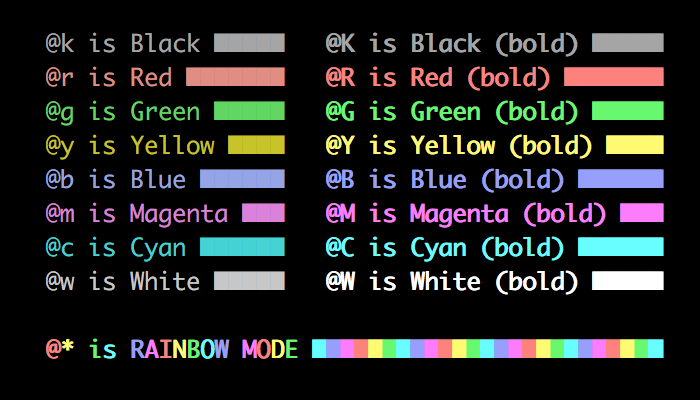

ANSI - A Colorful Formatter for Go
==================================


Ever wanted colorful output from your Golang CLI projects, but
don't want to have to muck up your codebase with unsightly ANSI
escape sequences?

Then this is the module for you!

Usage
-----

`go-ansi` provides a drop-in replacement for `fmt.Printf` and
friends that recognized an additional set of formatter flags for
colorizing output.

```go
import (
  fmt "github.com/jhunt/go-ansi"
)

func main() {
    err := DoSomething()
    if err != nil {
        fmt.Printf("error: @R{%s}", err)
    }
}
```

`ansi.Fprintf`, `ansi.Sprintf` and `ansi.Errorf` behave similarly,
exporting the exact same call signature as their `fmt` bretheren, but
handling the ANSI color sequences for you.

Formatting Codes
----------------

The colorizing formatting codes all look like this:

    @ <color> { <text> }



(for the image-averse and search engines:)

```
  @k is Black         @K is Black (bold)
  @r is Red           @R is Red (bold)
  @g is Green         @G is Green (bold)
  @y is Yellow        @Y is Yellow (bold)
  @b is Blue          @B is Blue (bold)
  @m is Magenta       @M is Magenta (bold)
  @c is Cyan          @C is Cyan (bold)
  @w is White         @W is White (bold)
```

You can now also activate super-awesome RAINBOW mode with
`@*{...}`

Contributing
------------

1. Fork the repo
2. Write your code in a feature branch
3. Create a new Pull Request
